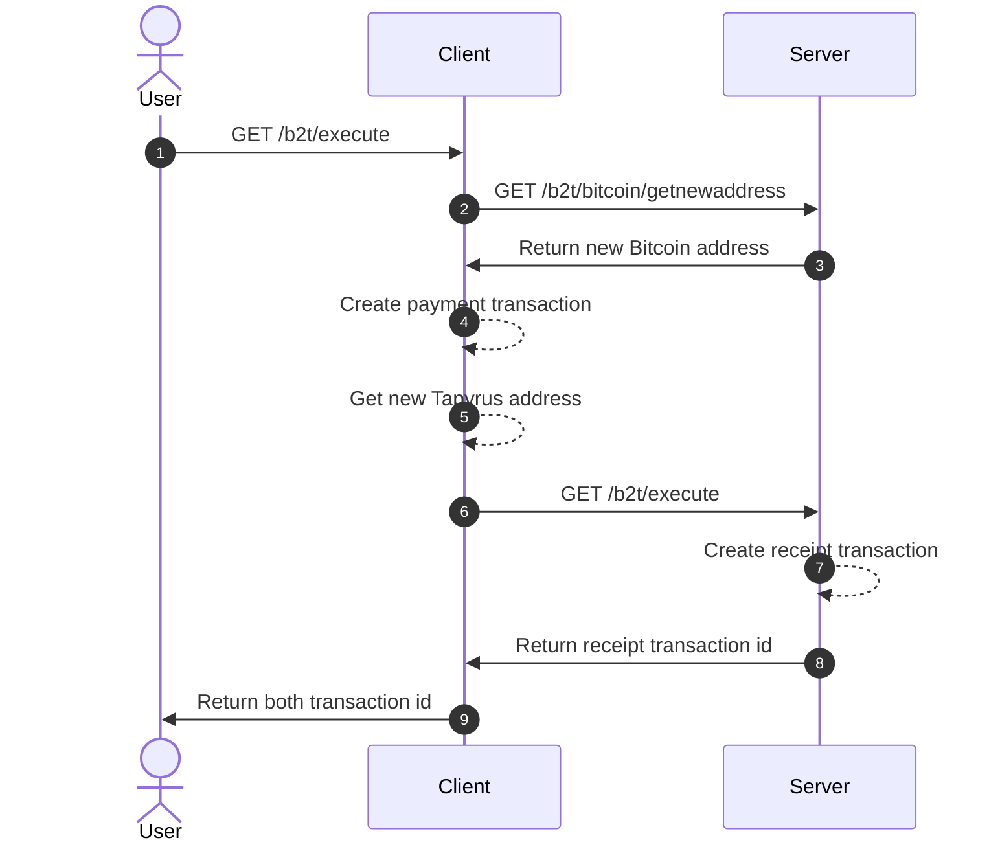

# b2t.client

BTC to TPC client.



## setup

```bash
$ docker compose up -d
```

## usage

- ヘルスチェック  
  http://localhost:4567/health

- 実行  
  http://localhost:4567/b2t/execute?amount=xxx へ GET リクエスト
